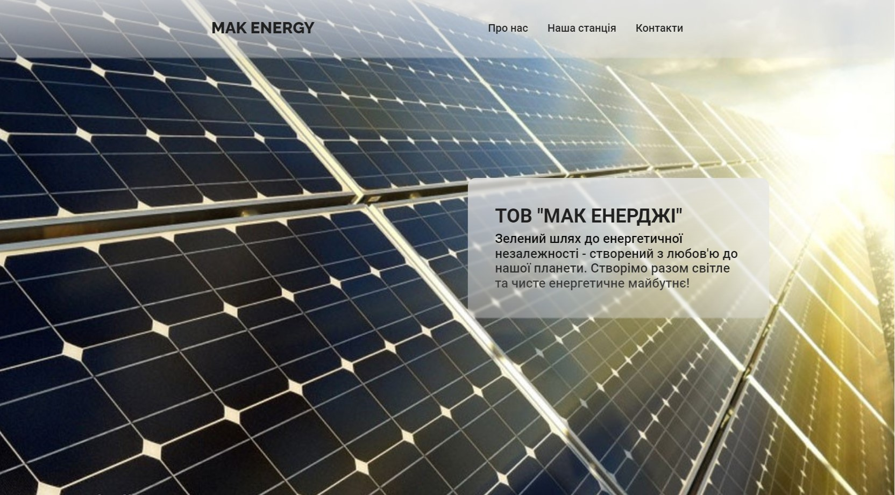

Замовник та Технології:

- Проект реалізовано на замовлення компанії ТОВ "Мак Енерджі", що спеціалізується на виробництві електроенергії за допомогою сонячної електростанції.

- Використані технології: html, SASS, JS, SEO.

Використані Практики та Засоби:

- Семантична розмітка для покращення доступності та SEO.

- Методологія БЕМ для структурування та організації коду.

- Адаптивний дизайн для оптимального відображення на різних пристроях.

- Використання ARIA для покращення доступності веб-додатка.

Реалізовані Функціональності:

- Повноекранна секція герой для фону.

- Меню-бургер з анімацією для мобільної версії сайту.

- Плавний скрол до розділів з використанням меню навігації.

- Галерея фото, з повноекранним відкриттям зображення.

- Контакти з інтегрованою Google map.

